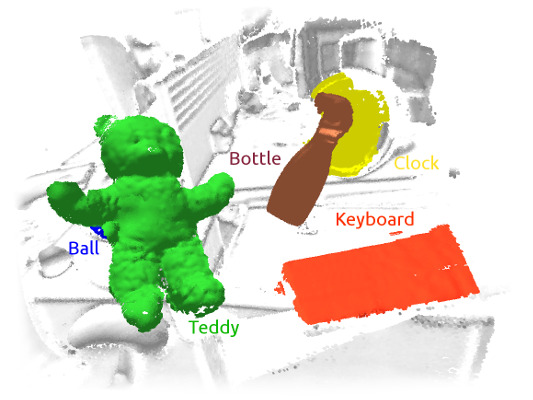
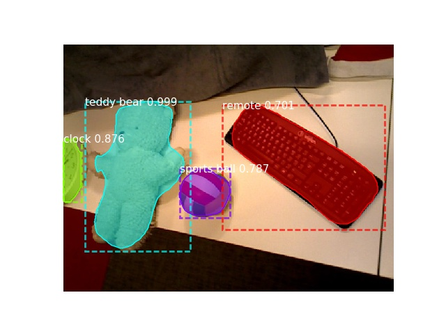

# MaskFusion

This repository contains MaskFusion, a real-time, object-aware, semantic and dynamic RGB-D SLAM system that goes beyond traditional systems that output a geometry-only map -- MaskFusion recognizes, segments and assigns semantic class labels to different objects in the scene, while tracking and reconstructing them even when they move independently from the camera.

As an RGB-D camera scans a cluttered scene, image-based instance-level semantic segmentation creates semantic object masks that enable real-time object recognition and the creation of an object-level representation for the world map. Unlike previous recognition-based SLAM systems, MaskFusion does not require prior knowledge or known models of the objects it can recognize and can deal with multiple independent motions. Unlike recent semantics enabled SLAM systems that perform voxel-level semantic segmentation MaskFusion takes full advantage of using instance-level semantic segmentation to enable semantic labels to be fused into an object-aware map. We show augmented-reality applications, that demonstrate the unique features of the map output by MaskFusion: instance-aware, semantic and dynamic.

More information and the paper can be found [here](http://visual.cs.ucl.ac.uk/pubs/maskfusion/index.html).

## Publication

* [MaskFusion: Real-Time Recognition, Tracking and Reconstruction of Multiple Moving Objects](https://arxiv.org/abs/1804.09194), Martin Rünz, Maud Buffier, Lourdes Agapito, ISMAR '18

## Building MaskFusion
The script `build.sh` shows step-by-step how MaskFusion is built and which dependencies are required.
The following CMake options are mandatory: `PYTHON_VE_PATH`, `MASKFUSION_MASK_RCNN_DIR` and it is recommended to set `MASKFUSION_GPUS_MASKRCNN` as well.

### CMake options:
* `MASKFUSION_GPUS_MASKRCNN`: List of GPUs used by MaskRCNN, ideally disjunct from SLAM GPU
* `MASKFUSION_GPU_SLAM`: GPU use by SLAM system, this has to be the GPU used by OpenGL
* `MASKFUSION_MASK_RCNN_DIR`: Path to your [Matterport MaskRCNN](https://github.com/matterport/Mask_RCNN) installation
* `MASKFUSION_NUM_GSURFELS`: Surfels allocated for environment model
* `MASKFUSION_NUM_OSURFELS`: Surfels allocated per object model
* `PYTHON_VE_PATH`: Path to (the root of) virtual python environment, used for tensorflow

### Dependencies
* Python3
* Tensorflow (>1.3.0, tested with 1.8.0)
* Keras (>2.1.2)
* MaskRCNN

## Running MaskFusion

* **Select the object categories** you would like to label by MaskRCNN. To do so, adjust the array `FILTER_CLASSES` within `Core/Segmentation/MaskRCNN/MaskRCNN.py.in`. For instance, `FILTER_CLASSES = ['person', 'skateboard', 'teddy bear']` results in _skateboards_ and _teddy bears_ being tracked. In the current setup, regions that are labelled as _person_ are ignored. An empty array indicates that all possible labels should be used.

* Tracking of individual objects can easily be enabled / disabled by calling `makeStatic()` and `makeNonStatic()` of instances of the `Model` class. The overall system runs more robustly if objects are only tracked when being touched by a person. We are **not** providing hand-detection software at the moment.

## Dataset and evaluation tools

### Tools
* Recorder for klg files: https://github.com/mp3guy/Logger2
* Viewer for klg files: https://github.com/mp3guy/LogView
* Images -> klg converter: https://github.com/martinruenz/dataset-tools/tree/master/convert_imagesToKlg
* klg -> images/pointclouds: https://github.com/martinruenz/dataset-tools/tree/master/convert_klg
* Evaluate segmentation (intersection-over-union): https://github.com/martinruenz/dataset-tools/tree/master/evaluate_segmentation
* Scripts to create synthetic datasets with blender: https://github.com/martinruenz/dataset-tools/tree/master/blender

## Hardware
In order to run MaskFusion smoothly, you need a fast GPU with enough memory to store multiple models simultaneously. We used an Nvidia TitanX for most experiments, but also successfully tested MaskFusion on a laptop computer with an Nvidia GeForce™ GTX 960M. If your GPU memory is limited, the `MASKFUSION_NUM_GSURFELS` and `MASKFUSION_NUM_OSURFELS` CMake options can help reduce the memory footprint per model (global/object, respectively).
While the tracking stage of MaskFusion calls for a fast GPU, the motion based segmentation performance depends on the CPU and accordingly, having a nice processor helps as well.

## ElasticFusion
The overall architecture and terminal-interface of MaskFusion is based on [ElasticFusion](https://github.com/mp3guy/ElasticFusion) and the ElasticFusion [readme file](https://github.com/mp3guy/ElasticFusion/blob/master/README.md) contains further useful information.

## New command line parameters (see [source-file](https://github.com/martinruenz/maskfusion/blob/master/GUI/MainController.cpp#L34-L96))

* **-method:**        Method used for segmentation (cofusion, maskfusion)
* **-frameQ:**        Set size of frame-queue manually
* **-run**:           Run dataset immediately (otherwise start paused).
* **-static**:        Disable multi-model fusion.
* **-confO**:         Initial surfel confidence threshold for objects (default 0.01).
* **-confG**:         Initial surfel confidence threshold for scene (default 10.00).
* **-segMinNew**:     Min size of new object segments (relative to image size)
* **-segMaxNew**:     Max size of new object segments (relative to image size)
* **-offset**:        Offset between creating models
* **-keep**:          Keep all models (even bad, deactivated)
* **-dir**:           Processes a log-directory (Default: Color####.png + Depth####.exr [+ Mask####.png])
* **-depthdir**:      Separate depth directory (==dir if not provided)
* **-maskdir**:       Separate mask directory (==dir if not provided)
* **-exportdir**:     Export results to this directory, otherwise not exported
* **-basedir**:       Treat the above paths relative to this one (like depthdir = basedir + depthdir, default "")
* **-colorprefix**:   Specify prefix of color files (=="" or =="Color" if not provided)
* **-depthprefix**:   Specify prefix of depth files (=="" or =="Depth" if not provided)
* **-maskprefix**:    Specify prefix of mask files (=="" or =="Mask" if not provided)
* **-indexW**:        Number of digits of the indexes (==4 if not provided)
* **-nm**:            Ignore Mask####.png images as soon as the provided frame was reached.
* **-es**:            Export segmentation
* **-ev**:            Export viewport images
* **-el**:            Export label images
* **-em**:            Export models (point-cloud)
* **-en**:            Export normal images
* **-ep**:            Export poses after finishing run (just before quitting if '-q')
* **-or**:            Outlier rejection strength (default 3).

## Tips

### Running MaskRCNN offline, before executing MaskFusion
You can use the script `Core/Segmentation/MaskRCNN/offline_runner.py` to extract masks readable by MaskFusion and visualisations. Use the `-maskdir` parameter to input these masks into MaskFusion.
Example usage: `./offline_runner.py -i /path/to/rgb/frames -o /path/to/output/masks --filter teddy_bear`

The visualization of the output will look like this:

### Resolve the exception '***Could not open MaskRCNN module***':
* Check python output (run directly in terminal)
* Check value of CMake option `MASKFUSION_MASK_RCNN_DIR`
* Check value of CMake option `MASKFUSION_PYTHON_VE_PATH`
* Check if python package [pycocotools](https://github.com/waleedka/coco) is missing
* Check if python package [imgaug](https://github.com/aleju/imgaug) is missing
* Check if enough GPU memory is available
* Check variables `PYTHON_VE_PATH` and `MASK_RCNN_DIR` in `MaskRCNN.py` in your build directory

### Resolve the exception '***cudaSafeCall() Runtime API error : unknown error.***' at start-up
One reason for having this exception at start-up can be that OpenGL and Cuda are unable to share memory. Double-check the cmake parameter `MASKFUSION_GPU_SLAM`, especially in a multi-gpu setup.

### Using cv::imshow for debugging
`cv::imshow(...)` requires the library `libopencv_highgui.so`, which might (if GTK is used) depend on `libmirprotobuf.so` and hence on a specific *protobuf* version. The program, however, is also going to require a specific *protobuf* version and it can happen that the two versions are clashing leading to an error message like this: *This program requires version 3.5.0 of the Protocol Buffer runtime library, but the installed version is 2.6.1.  Please update your library.  If you compiled the program yourself, make sure that your headers are from the same version of Protocol Buffers as your link-time library.*
The easiest fix is to compile OpenCV with `-DWITH_QT=ON`, which removes the *protobuf* dependency of `libopencv_highgui.so`.

### Crash (segfault) when loading python module ***MaskRCNN.py***
We noticed that loading the python module `MaskRCNN.py` can crash when the executable links to *hdf5* as this is potentially incompatible with the version required by *tensorflow*. Make sure to use the *opencv* library that is built in the deps subdirectory, which does not require linking to *hdf5*. (Set `OpenCV_DIR=<path>/deps/opencv/build` in cmake)

## License
MaskFusion includes the third-party open-source software ElasticFusion, which itself includes third-party open-source software. Each of these components have their own license.

You can find the ElasticFusion license in the file [LICENSE-ElasticFusion.txt](LICENSE-ElasticFusion.txt) and
the MaskFusion license in the file [LICENSE-MaskFusion.txt](LICENSE-MaskFusion.txt)

## Acknowledgements
This work has been supported by the SecondHands project, funded from the EU Horizon 2020 Research and Innovation programme under grant agreement No 643950.
